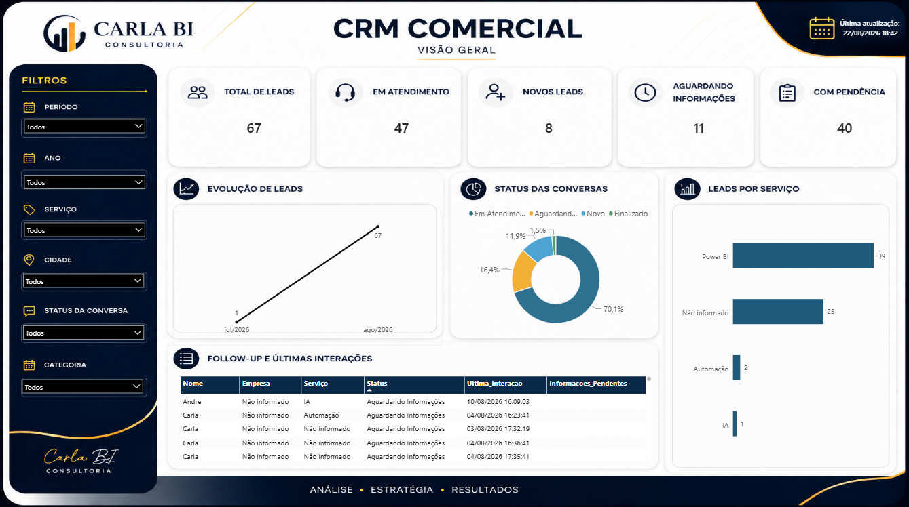
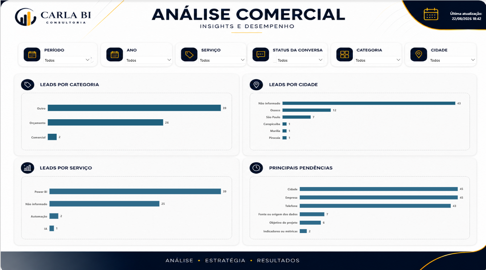

# CRM Comercial — BI + Automação

Projeto de portfólio desenvolvido para simular um processo comercial automatizado, desde a chegada de uma solicitação por e-mail até a análise dos atendimentos no Power BI.

A proposta foi além da criação de um dashboard: construir o fluxo completo do dado.

**Gmail → n8n → Google Sheets → Power BI**

---

## 🎯 Objetivo do projeto

Criar uma estrutura simples de CRM para acompanhar solicitações comerciais, automatizar o atendimento inicial e transformar os dados gerados pelo processo em indicadores e análises comerciais.

O projeto foi desenvolvido com foco em:

- Automação do processo de atendimento
- Organização dos dados comerciais
- Controle do status das conversas
- Identificação de informações pendentes
- Acompanhamento de leads
- Análise de indicadores no Power BI

---

## 🔄 Fluxo do projeto

Gmail
  ↓
n8n
  ↓
Google Sheets
  ↓
Power BI

## ⚙️ Automação com n8n

O n8n foi utilizado para automatizar o fluxo inicial de atendimento comercial.

O processo simula a chegada de uma solicitação por e-mail e realiza o tratamento das informações antes de armazená-las na base.

Principais etapas:

- Recebimento da solicitação via Gmail
- Identificação das informações disponíveis
- Verificação de informações pendentes
- Solicitação automática dos dados faltantes
- Acompanhamento da continuidade da conversa
- Identificação da conversa por Email_ID e Thread_ID
- Atualização do atendimento existente
- Tratamento para evitar duplicidade de leads

A utilização do Thread_ID permite reconhecer quando uma nova resposta pertence à mesma conversa, evitando a criação de um novo lead para cada interação.

---

## 📊 Base de dados — Google Sheets

O Google Sheets foi utilizado como base estruturada dos atendimentos processados pelo fluxo.

Entre as informações utilizadas estão:

- Data
- Cliente
- Empresa
- Serviço
- Categoria
- Cidade
- Status da conversa
- Última interação
- Informações pendentes
- Email_ID
- Thread_ID

A base foi estruturada para permitir a atualização dos dados e posterior análise no Power BI.

---

## 📈 Power BI

A base de atendimentos foi conectada ao Power BI para criação das análises comerciais.

O projeto possui duas páginas principais.

### Visão Geral CRM

A visão geral apresenta os principais indicadores operacionais:

- Total de Leads
- Leads em Atendimento
- Novos Leads
- Leads Aguardando Informações
- Leads com Pendência
- Evolução dos Leads
- Status das Conversas
- Leads por Serviço
- Follow-up e Últimas Interações



### Análise Comercial

A segunda página apresenta uma visão analítica da operação comercial.

Principais análises:

- Leads por Categoria
- Leads por Cidade
- Leads por Serviço
- Principais Pendências

Filtros utilizados:

- Período
- Ano
- Serviço
- Status da Conversa
- Categoria
- Cidade



---
## 🧮 Indicadores e DAX

Foram utilizadas medidas em DAX para criação dos principais indicadores do CRM.

### Total de Leads

```DAX
Total Leads =
DISTINCTCOUNT(fAtendimentos[Thread_ID])

### Leads em Atendimento

```DAX
Leads Em Atendimento =
CALCULATE(
    [Total Leads],
    fAtendimentos[Status] = "Em Atendimento"
)

Leads Aguardando Informações =
CALCULATE(
    [Total Leads],
    fAtendimentos[Status] = "Aguardando Informações"
)

Leads Com Pendência =
CALCULATE(
    [Total Leads],
    FILTER(
        fAtendimentos,
        NOT ISBLANK(fAtendimentos[Informacoes_Pendentes])
            && fAtendimentos[Informacoes_Pendentes] <> ""
    )
)

Leads Novos =
CALCULATE(
    [Total Leads],
    fAtendimentos[Status] = "Novo"
## 🧮 Indicadores e DAX

Foram utilizadas medidas em DAX para criação dos principais indicadores do CRM.

### Total de Leads

```DAX
Total Leads =
DISTINCTCOUNT(fAtendimentos[Thread_ID])
```

### Leads em Atendimento

```DAX
Leads Em Atendimento =
CALCULATE(
    [Total Leads],
    fAtendimentos[Status] = "Em Atendimento"
)
```

### Leads Aguardando Informações

```DAX
Leads Aguardando Informações =
CALCULATE(
    [Total Leads],
    fAtendimentos[Status] = "Aguardando Informações"
)
```

### Leads Com Pendência

```DAX
Leads Com Pendência =
CALCULATE(
    [Total Leads],
    FILTER(
        fAtendimentos,
        NOT ISBLANK(fAtendimentos[Informacoes_Pendentes])
            && fAtendimentos[Informacoes_Pendentes] <> ""
    )
)
```

### Leads Novos

```DAX
Leads Novos =
CALCULATE(
    [Total Leads],
    fAtendimentos[Status] = "Novo"
)
```

---

## 🧠 Regras de negócio

O projeto considera cada conversa comercial como um lead único, utilizando o `Thread_ID` como identificador da conversa.

Dessa forma, novas mensagens dentro da mesma conversa não geram novos leads.

As informações pendentes também são utilizadas para identificar atendimentos que precisam de acompanhamento, permitindo visualizar quais dados ainda precisam ser complementados pelo cliente.

Os indicadores foram construídos com medidas DAX para permitir análises dinâmicas conforme os filtros aplicados no relatório.

---

## 🛠️ Tecnologias utilizadas

- **n8n** — automação do fluxo de atendimento
- **Gmail** — entrada das solicitações comerciais
- **Google Sheets** — armazenamento e organização dos dados
- **Power BI** — análise e visualização dos indicadores
- **DAX** — criação das métricas e regras de negócio

---

## 📚 Aprendizados

O desenvolvimento deste projeto permitiu trabalhar de forma integrada diferentes etapas de um processo de dados:

- Automação de processos
- Tratamento e organização de dados
- Estruturação de uma base para análise
- Identificação de regras de negócio
- Criação de indicadores com DAX
- Desenvolvimento de dashboards no Power BI
- Integração entre automação, dados e BI

O principal aprendizado foi entender o processo de ponta a ponta: desde a entrada do dado até sua transformação em informação para análise e tomada de decisão.


---

## 🔗 Projeto

Este repositório apresenta a estrutura e os materiais utilizados no desenvolvimento do projeto.

**Dashboard:** Power BI  
**Automação:** n8n  
**Base:** Google Sheets

---

## 📁 Arquivos do projeto

- `CRM_Comercial_Carla_BI.pbix` — arquivo do projeto desenvolvido no Power BI
- `crm-comercial-n8n-public.json` — workflow do n8n com dados sensíveis removidos
- `crm-comercial.png` — visão geral do CRM
- `analise-comercial.png` — análise comercial
- `README.md` — documentação do projeto

---

## 🎥 Demonstração

O vídeo apresenta o fluxo completo do projeto:

**Gmail → n8n → Google Sheets → Power BI**

A demonstração mostra a chegada da solicitação comercial, o processamento automatizado, a atualização da base e a análise dos dados no Power BI.
